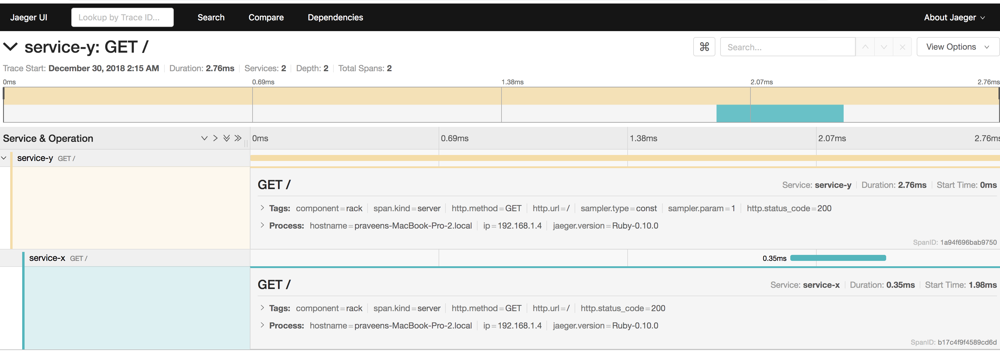

## Sample ruby applications for distributed tracing using Jaeger and OpenTracing


### Workflow
 - service-y calls service-x

### Setup

**1. Launche the Jaeger UI, collector, query, and agent, with an in memory storage component.**

```
docker run -d -e COLLECTOR_ZIPKIN_HTTP_PORT=9411 -p5775:5775/udp -p6831:6831/udp -p6832:6832/udp -p5778:5778 -p16686:16686 -p14268:14268 -p9411:9411 jaegertracing/all-in-one:latest
```
Verify that the Web UI is accessible at `http://localhost:16686`

**2. Run service-x**
```
bundle install
ruby service-x/server.rb -p 4567
curl http://localhost:4567
```

**3. Run service-y**
```
bundle install
ruby service-x/server.rb -p 4568
curl http://localhost:4568
```

### Collect distributed trace on Jaeger UI



